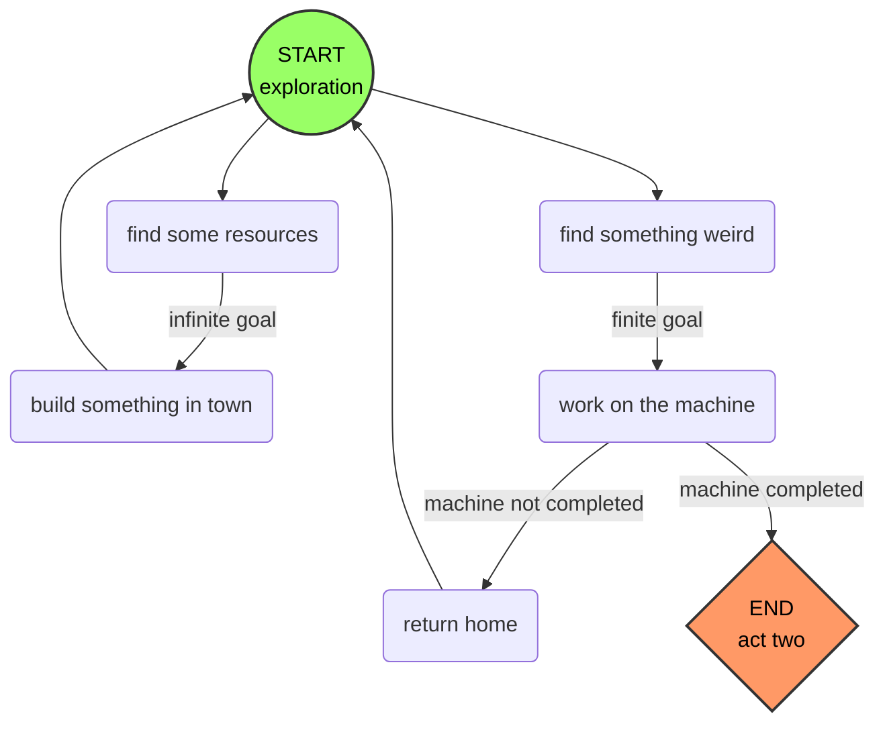

#### Preamble:
*I have made use of internal links here, which I've found to be extremely useful for adding asides and notes without distracting from the main content. You can click on [[Colin's Vision#Preamble|these links]], which will take you to the text block it refers to, but possibly the best way is to simply hover over the link and press "ctrl," which will show a preview window of the text block so you don't have to go back and find your place again.*

## Elevator Pitch
With obligations to a powerful nobleman and an ailing wife, you must do what needs to be done to save her before it's too late. Find, trade, and craft increasingly rare components to build a machine that will heal your wife, all while collecting resources to build structures for the nobleman's newly established town. All seems well until it is revealed that your wife had already passed right before the game began and the trauma caused you to finally crack. All of your efforts led you to the creation of an infernal mechanism which brings your beloved back, at the cost of unleashing demonic forces into her very being. What will you do now?

## The Player's Experience
*This represents what I believe the ideal player experience to be. Of course, different players will have different experiences, but this is the "goal." I have written it entirely in the second person, blurring the line between player and protagonist to simulate the player's immersion in their role, while only showing what the **PLAYER** knows, not what the **PROTAGONIST** knows.*

You are a renowned medieval woodsman and artificer from a large city who suddenly moved the countryside. Your dearly beloved wife is bedridden, her condition worse still than when you moved in order to help her recover outside of the bustle and noise. You've made a deal with a local nobleman to construct his new settlement: for each new residence or business built, the nobleman [[Colin's Vision#^greedy-nobleman|will pay you]] a specified amount. 

While you are often busy collecting resources and building structures, your real motivation is getting your hands on rare components and materials which are needed to construct the life-saving machine which will save your wife, no matter what anyone thinks about it. Still, it's best if it doesn't come up in [[Colin's Vision#^dialogue-musings|conversation]]. Some components and materials can be found in the mines or in the forest, others can be built if one has the raw resources and knowledge, and some can only be purchased from [[Colin's Vision#^allure-occupations|townspeople with specific occupations]].

As the town grows, you continue to meet new people and interact with those who have settled in. Throughout this time, your resolve to help your wife overcome her ailment is as strong as ever and every night, you talk to her and reassure her, even if she is too weak to respond. Your relationships with your wife and the townspeople strengthen even more.

As the machine nears completion, you start to notice more unusual things. The components you need are increasingly strange, even sinister. You realize that you've still never seen your wife, [[Colin's Vision#^every-night|only the outside of the house]] and what you've said to her. Still, you try not to think too hard about it and focus on the greater goal. The thought lingers in the back of your mind - *what is actually going on here?*

Finally, you get your hands on the last component needed for the machine. It is almost time. You go home for the night as usual, but this time you finally get to see the inside. There is nobody there, nobody at all. You begin talking to your wife as if everything is normal anyway, and that lingering thought overwhelms you. *What is going on??*

The next day arrives and it is time to power on the machine. You hesitate, now apprehensive as to its purpose, but you proceed to turn it on anyway. Nothing happens. A few seconds pass. Then, a thunderous **BOOM** shatters the stillness in an instant, and the ground begins to rumble. The machine's complex mechanisms churn and shudder, and the sky grows dark. Cracks appear in the dirt, centered around the machine as it almost seems to hover over what is quickly becoming a sinkhole. An eerie red glow spills out from the earth as the machine rises into the air, over your head. It spins with ever-increasing vigor before a massive pillar of blood engulfs the machine from below and you cover your eyes with your arms, barely able to move from the spectacle of it all.

Then... nothing. You lower your arms and look around. You realize you must have finally gone insane. The earth is quite intact, the sun is shining, and the air is still. The machine is sitting firmly on the ground, silent - and empty. 

A gentle breeze kisses your face. *That scent... it's so... familiar...*

You look up to see the soft form of a person floating down from the sky, swathed in flowing white fabric. She slowly lands in your outstretched arms as all of your fears and worries dissipate. *It's her.* 

Your rare moment of comfort does not last long, however. As you look more closely at her face, something begins to feel wrong. Her eyes are wide open and blood red. Her face is just *wrong.* Suddenly, she's standing in front of you, back arched, head towards the sky, arms outstretched, and lets out a piercing scream. It's like a keg of gunpowder was detonated where she stood: the machine, your house, and the surrounding earth are demolished, leaving behind a massive crater as debris rains down. You are flung backward but somehow survive. As you pick yourself up, she approaches you, both feet dragging the ground as she hovers a few inches above it.

*Join me*, she whispers hoarsely. *Let us bring your friends as well.* She looks around at the surrounding houses hungrily and reaches a hand out, beckoning. As you continue to regain your bearings, you notice your trusty axe had landed on the ground nearby after the explosion. *Yes*, she croaks, *that will do nicely.* You pick up the axe, its familiar weight seeming lighter than usual. *Join me and we will never be apart again.* You lock eyes and bring the axe up to your shoulder. She smiles wickedly and begins to make her way to the nearest residence, her back facing you. 

You raise the axe...
Where does it land?

## Story Details Not Covered Above
*I will also be using P to refer to the protagonist*

- P knew when his wife died. He was already reaching his limits and it caused him to lose touch with reality. He went into a full frenzy, not even conscious of his actions, and designed the machine (more about that in the next bullet point). By the time the game starts, he is basically dead inside, still himself but only just, and spends his days going through the motions as he nears his goal of bringing his wife back.
- P used to work with the nobleman in the city, and he knows about P's wife being dead. He is a clandestine practitioner of Dark Arts, and was the one who supplied the arcane component list and combined his knowledge of magic with P's engineering skills to design the machine.
- Canonically, P's wife suffered and died from "consumption," aka tuberculosis

## Gameplay
### Core Loop
The main gameplay section of the game (what Cameron calls [[Cameron's Vision#Act One|Act One]]) is centered around gathering resources and constructing new buildings for the town, while working towards completing the machine. The game will mostly only progress when you make progress on the machine (although the passing of days will also keep things moving), and town-building is unrestricted. Time-of-day should be a thing, so players can't just go crazy on the town building and never ever get to the next day.

*Fig. 1: High-level gameplay loop of Act One*

### Systems 
*Crucial systems and/or their sub-systems are bold+italic*

- ***Resource Collection***
	- ***tree felling***
	- ***mining***
- ***Crafting***
	- ***machine-specific crafting***
	- basic item crafting
	- log splitting
	- lumber milling
- ***Exploration***
	- ***random generation***
		- trees
		- rocks
		- ores
		- machine components (only generate at certain times/order)
	- the mine?
		- more/better rocks and ores?
		- [[Colin's Vision#^enemies|enemies]]?
- ***Narrative***
	- ***talk to villagers***
	- simple quests
- ***Day/Night cycle***
	- player has to go to bed at night
		- no punishment like SV, maybe a cutscene just cuts you off?
	- free to do what you want all day
- Combat? (see "enemies?" link above)

## Setting
Medieval-ish times on an empty piece of land not too far from but not too close to the nearest city. This city is where the nobleman lives, and where the protagonist moved from. 

## Aesthetics
8x8-based pixel art, with slightly desaturated colors and rich blacks. Red is only ever used for blood.

## ADDENDUM A: Thinking Too Much
What happens if you try to kill a villager? Most of them would die in one hit. You can carry the body around? Bring them to the machine and nothing happens, but if you leave them there and nobody sees you do it then something extra happens when it turns on. Maybe if you sacrifice someone, she comes back not evil? Scope monster approaches... ^kill-a-villager

The nobleman is incentivized to pay for new construction because he owns the land and wants to earn taxes from people living on it. ^greedy-nobleman

Maybe you could build things that will allure certain occupations to come to settle down in order to procure certain components if that occupation is not yet present in your town. Examples below. ^allure-occupations

(had to separate this section for the link tag to work)
Possible occupations include:
- Baker
- Farmer
- ~~Watchmaker~~
- Blacksmith
- Priest/Vicar
- Herbalist/Apothecary
- Artisan/Ceramicist
- Scribe
	- What if you have to find a carved runic stone somewhere and have the scribe copy its unreadable writings onto a page or onto a metal part to be used in the machine?

Not sure how deep the dialogue system should go... Writing takes time and the more response options available, the more there is to write and manage. Mr. ChatGPT does indeed exist but man, I'd be very concerned about the quality. Maybe as a starting point? Anyway, it's probably out of scope to have the dialogue seriously effect the game outcomes so idk. This is a discussion for another time. ^dialogue-musings

Current thoughts are that every night, you return home but the camera stays on the outside of the building, while showing a speech bubble for what you say to your wife. This should make sense to the player, as the game never shows the inside of any building. ^every-night

Enemies in the mine... hmmm, something smells like a ConcernedApe in here! I'm not too sure about having enemies at all. It would have to be either in a specific area, like how SV does it (so as not to detract from chill feelings) or be done in a specific and not-too-threatening way, like the opposite of how Factorio does it. Austin's idea of the "Outside" does fit with the former, as long as they're considered secluded areas and enemies can't freely enter the town. Having enemies does provide a new source for components/materials, so that is something to consider. ^enemies