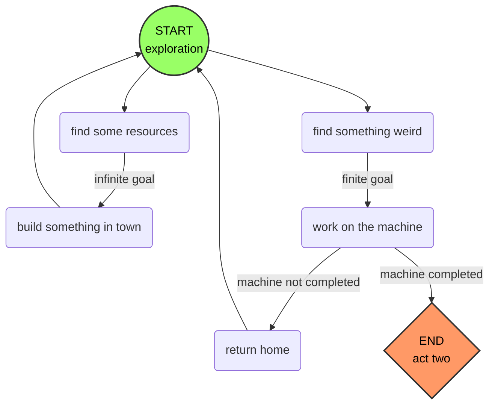

# Elevator Pitch
With obligations to a powerful nobleman and an ailing wife, you must do what needs to be done to save her before it's too late. Find, trade, and craft increasingly rare components to build a machine that will heal your wife, all while collecting resources to build structures for the nobleman's newly established town. All seems well until it is revealed that your wife had already passed right before the game began and the trauma caused you to finally crack. All of your efforts led you to the creation of an infernal mechanism which brings your beloved back, at the cost of unleashing demonic forces into her very being. What will you do now?

# Setting
End of the 1600s in medieval England on an empty piece of land not too far from but not too close to the nearest city. This city is where the nobleman lives, and where the protagonist moved from. 

# Aesthetics
Top-down oblique pixel art, with slightly desaturated colors and rich blacks. The goal is to feel comfortable but slightly dreary before switching to a more stark look for Act 3. Red is only ever used for blood.

# Story
## Act 1
*A mostly tranquil experience*
You are a renowned medieval woodsman and artificer from a large city who suddenly moved the countryside. Your dearly beloved wife is bedridden, her condition worse still than when you moved in order to help her recover outside of the bustle and noise. You've made a deal with a local nobleman to construct his new settlement: for each new residence or business built, the nobleman [[Colin's Vision#^greedy-nobleman|will pay you]] a specified amount. 

While you are often busy collecting resources and building structures, your real motivation is getting your hands on rare components and materials which are needed to construct the life-saving machine which will save your wife, no matter what anyone thinks about it. Still, it's best if it doesn't come up in [[Colin's Vision#^dialogue-musings|conversation]]. Some components and materials can be found in the mines or in the forest, others can be built if one has the raw resources and knowledge, and some can only be purchased from [[Colin's Vision#^allure-occupations|townspeople with specific occupations]].

As the town grows, you continue to meet new people and interact with those who have settled in. Throughout this time, your resolve to help your wife overcome her ailment is as strong as ever and every night, you talk to her and reassure her, even if she is too weak to respond. Your relationships with your wife and the townspeople strengthen even more.

As the machine nears completion, you start to notice more unusual things. The components you need are increasingly strange, even sinister. You realize that you've still never seen your wife, [[Colin's Vision#^every-night|only the outside of the house]] and what you've said to her. Still, you try not to think too hard about it and focus on the greater goal. The thought lingers in the back of your mind - *what is actually going on here?*

## Act 2
*A shocking revelation*
Finally, you get your hands on the last component needed for the machine. It is almost time. You go home for the night as usual, but this time you finally get to see the inside. There is nobody there, nobody at all. The protagonist begins talking to your wife as if everything is normal anyway, and that lingering thought overwhelms you. *What is going on??*

The next day arrives and it is time to power on the machine. You hesitate, now apprehensive as to its purpose, but you proceed to turn it on anyway. Nothing happens. A few seconds pass. Then, a thunderous **BOOM** shatters the stillness in an instant, and the ground begins to rumble. The machine's complex mechanisms churn and shudder, and the sky grows dark. Cracks appear in the dirt, centered around the machine as it almost seems to hover over what is quickly becoming a sinkhole. An eerie red glow spills out from the earth as the machine rises into the air, over your head. It spins with ever-increasing vigor before a massive pillar of blood engulfs the machine from below and you cover your eyes with your arms, barely able to move from the spectacle of it all. 

## Act 3
*An unthinkable choice*
Then... nothing. You lower your arms and look around. You realize you must have finally gone insane. The earth is quite intact, the sun is shining, and the air is still. The machine is sitting firmly on the ground, silent - and empty. 

A gentle breeze kisses your face. *That scent... it's so... familiar...*

You look up to see the soft form of a person floating down from the sky, swathed in flowing white fabric. She slowly lands in your outstretched arms as all of your fears and worries dissipate. *It's her.* 

Your rare moment of comfort does not last long, however. As you look more closely at her face, something begins to feel wrong. Her eyes are wide open and blood red. Her face is just *wrong.* Suddenly, she's standing in front of you, back arched, head towards the sky, arms outstretched, and lets out a piercing scream. It's like a keg of gunpowder was detonated where she stood: the machine, your house, and the surrounding earth are demolished, leaving behind a massive crater as debris rains down. You are flung backward but somehow survive. As you pick yourself up, she approaches you, both feet dragging the ground as she hovers a few inches above it.

*Join me*, she whispers hoarsely. *Let us bring your friends as well.* She looks around at the surrounding houses hungrily and reaches a hand out, beckoning. As you continue to regain your bearings, you notice your trusty axe had landed on the ground nearby after the explosion. *Yes*, she croaks, *that will do nicely.* You pick up the axe, its familiar weight seeming lighter than usual. *Join me and we will never be apart again.* You lock eyes and bring the axe up to your shoulder. She smiles wickedly and begins to make her way to the nearest residence, her back facing you. 

You raise the axe...
Where does it land?

## Lore
*Story elements which took place before the game began*

# Gameplay
## Core Loop
The main gameplay section of the game ([[Game Concept#Act 1|Act 1]]) is centered around gathering resources and constructing new buildings for the town, while working towards completing the machine. The game will mostly only progress when you make progress on the machine (although the passing of days will also keep things moving), and town-building is unrestricted. Time-of-day should be a thing, so players can't just go crazy on the town building and never ever get to the next day.

*Fig. 1: High-level gameplay loop of Act One*

## Systems 
### Resources
- [[Just Thoughts#^standard-resources|Standard resources]] aka tool-required collection
	- Trees
	- Rocks
	- Ores
- [[Just Thoughts#^special-resources|Special resources]] aka tool-free collection
	- Gem
	- Rune
	- Feather
	- Moon-soaked stone
	- Human hair
- Crafting
	- Basic crafting
	- Tool/occupation-specific crafting
		- Sawmill
		- Flour milling
### Narrative
- Talk to villagers
- Quests
	- Machine components/construction
	- Personal (relationship-building) quests
### Day/Night Cycle
- Player must go to bed at night
- Player wakes up at set time
- Resource availability

