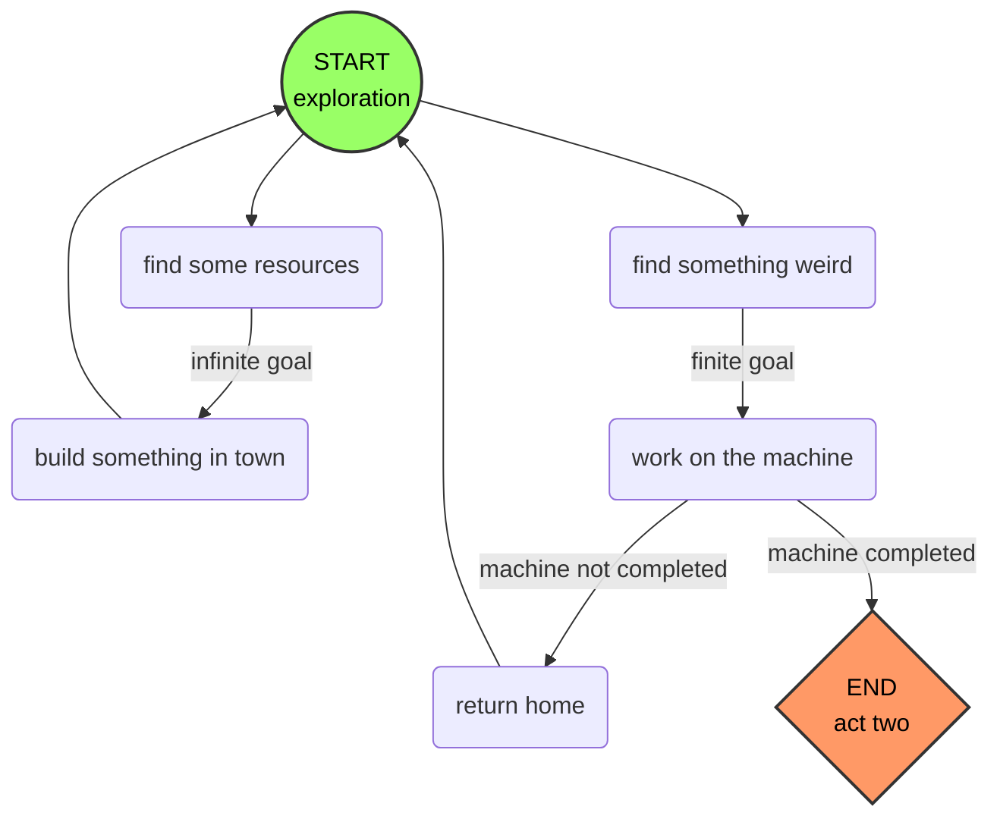

# Elevator Pitch (Needs revision)
With obligations to a powerful nobleman and an ailing wife, you must do what needs to be done to save her before it's too late. Find, trade, and craft increasingly rare components to build a machine that will heal your wife, all while collecting resources to build structures for the nobleman's newly established town. All seems well until it is revealed that your wife had already passed right before the game began and the trauma caused you to finally crack. All of your efforts led you to the creation of an infernal mechanism which brings your beloved back, at the cost of unleashing demonic forces into her very being. What will you do now?

# Story
## Lore
*Story elements which took place before the game began*

## Act 1
*A mostly tranquil experience*

## Act 2
*A shocking revelation*

## Act 3
*An unthinkable choice*

# Gameplay
## Core Loop
The main gameplay section of the game (what Cameron calls [[Cameron's Vision#Act One|Act One]]) is centered around gathering resources and constructing new buildings for the town, while working towards completing the machine. The game will mostly only progress when you make progress on the machine (although the passing of days will also keep things moving), and town-building is unrestricted. Time-of-day should be a thing, so players can't just go crazy on the town building and never ever get to the next day.

*Fig. 1: High-level gameplay loop of Act One*

## Systems 
### Resources
- Resource collection
	- Tree felling
	- Rock/ore mining
	- Pick up items
- Crafting
	- Basic crafting
	- Tool/occupation-specific crafting
		- Sawmill
		- Flour milling
### Exploration
- Random generation
	- [[Just Thoughts#^standard-resources|Standard resources]]
		- Trees
		- Rocks
		- Ores
	- [[Just Thoughts#^special-resources|Special resources]]
		- Gem
		- Rune
		- Feather
		- Moon-soaked stone
		- Human hair
### Narrative
- Talk to villagers
- Quests
	- Machine components/construction
	- Personal (relationship-building) quests
### Day/Night Cycle
- Player must go to bed at night
- Player wakes up at set time
- Resource availability

# Setting
Medieval-ish times on an empty piece of land not too far from but not too close to the nearest city. This city is where the nobleman lives, and where the protagonist moved from. 

# Aesthetics
8x8-based pixel art, with slightly desaturated colors and rich blacks. Red is only ever used for blood.
